# datastax_nsb
## Extensions for the no-sql-bench utility

This package allows the user to create and deploy a single node implementation of NOSQLBench
and it's associated apps for testing of DSE (or OSS) clusters.


This script will install and configure a self contained single nod benchmarking environment
 the deployment contains: 
  - local no-sql-bench install
  - single-node DSE docker container
  - Victoria Metrics docker container
  - Grafana container

## Usage:

### Set permissions and execute the setup script
```

cd datastax_nsb
chmod +x install_nsb_single_node_aws_i4.sh
./install_nsb_single_node_aws_i4.sh INSTALL
```

### verify things went well
```
./install_nsb_single_node_aws_i4.sh VERIFY
```

## EC2 Provisioning

### Choose an ubuntu flavor - tested with version 22.04


### Choose an instance type - tested with i4, must support nvme devices

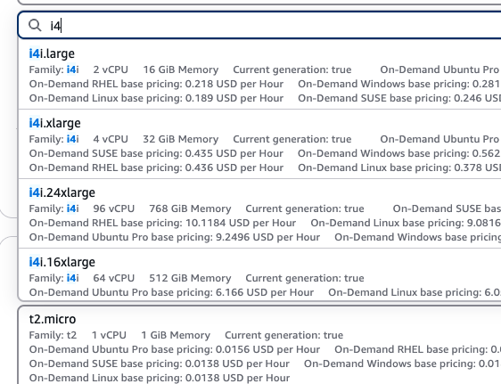

### Create 2 addtional volumes - use io1 for optimal iops performance

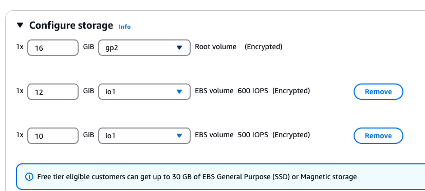

## Steps required once script completes
## Next steps - aka things you can't do in the script:

 - Open ports 8428, 3000, 9042 on the AWS security group
 - Connect to Victoria Metric UI at http://<ip>:8428 
 - Connect to Grafana at http://<ip>:3000 and: 
   - Create a prometheus datasource in Grafana - NOTE determine and use the private ip for the docker process:
        - to determine that ip, use ifconfig and look for the settings for the docker0 interface. will look something like
           docker0: flags=4163<UP,BROADCAST,RUNNING,MULTICAST>  mtu 1500
           inet <span style="color:blue">172.17.0.1</span>  netmask 255.255.0.0  broadcast 172.17.255.255
   - create an service account and api token in the grafana UI - NOTE, make sure to give the SA admin rights
      this token is added to a ~/.nosqlbench/grafana file you create
   -  create or import included dashboard - the example dashboard is setup using 'prometheus' as the 
       datasource name, which is the default in grafana. If you choose a different datasource name, you
       will need to replace the name 'prometheus' in the example dashboard json file.

### Access AWS Console, navigate to your vm, click the security tab and add 3 new rules

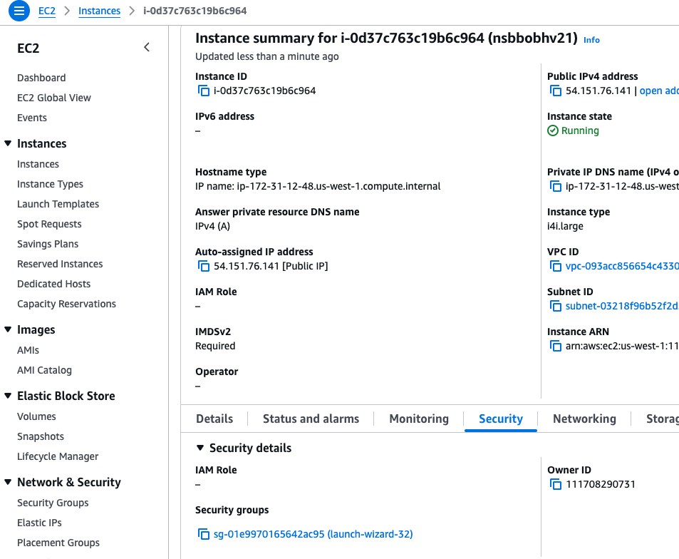
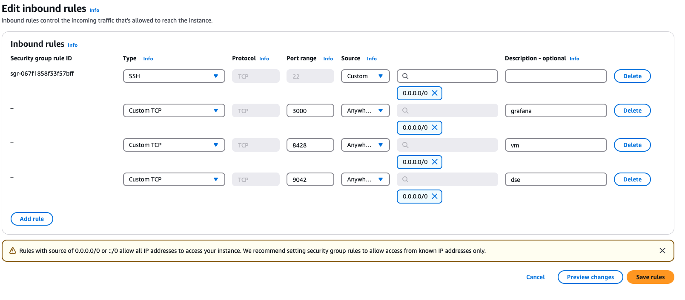

### Create a new Prometheus Connection
#### NOTE: Leave the default name 'prometheus' if you change this the nsb config must be changed
####  The IP here must be the local IP the Docker container is running on, you can check this by
####   typing this command in the vm: 
####            ifconfig
####   and look for the IP under the section docker


### Test and Save the string


### Create a Service Account.

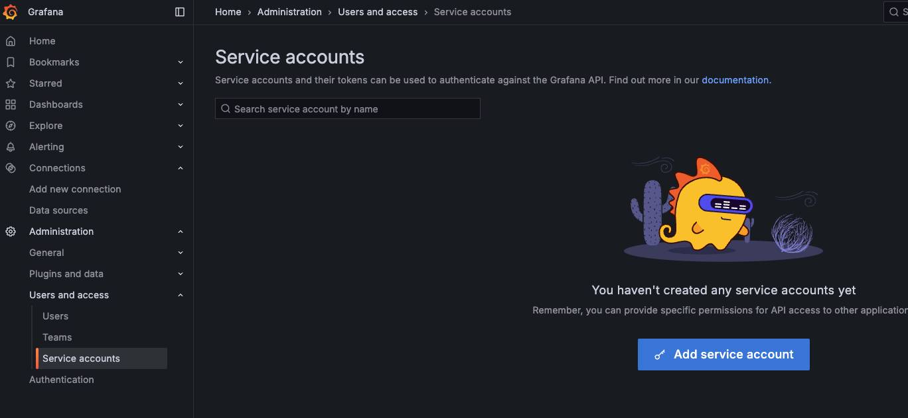
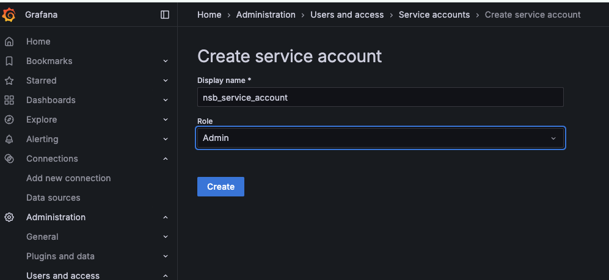

### Create a Token for the account. Copy n Paste the token
###  you can run the set_grafana_apikey.sh script to set this value in the VM

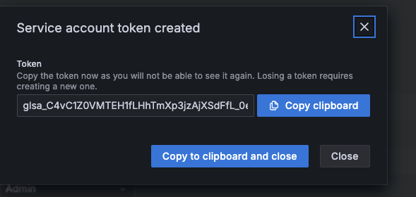

### Import the sample Dashboard. Import button is at the top-right in Grafana UI.
### You may encounter a bug with import, if you do just copy/paste the json

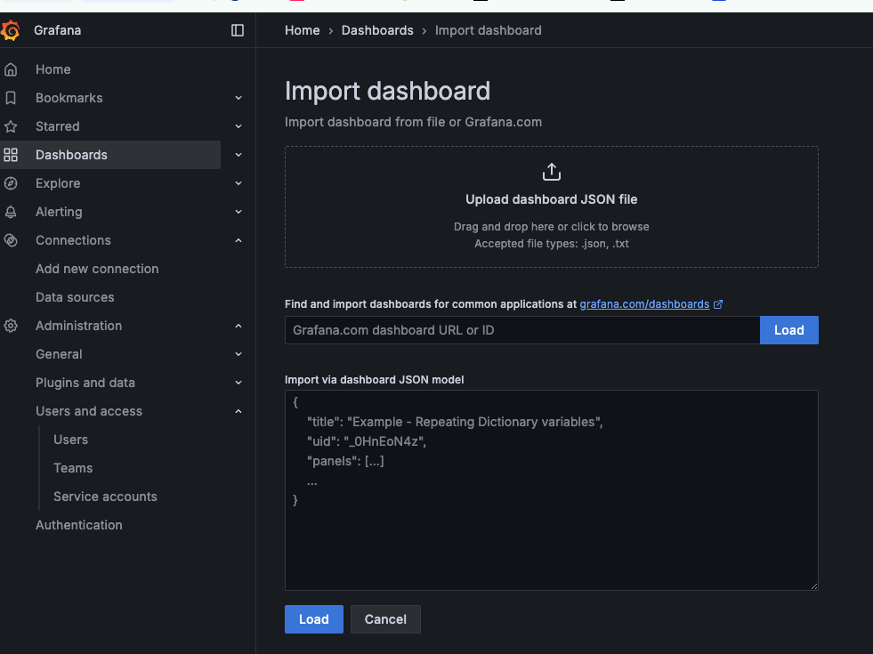
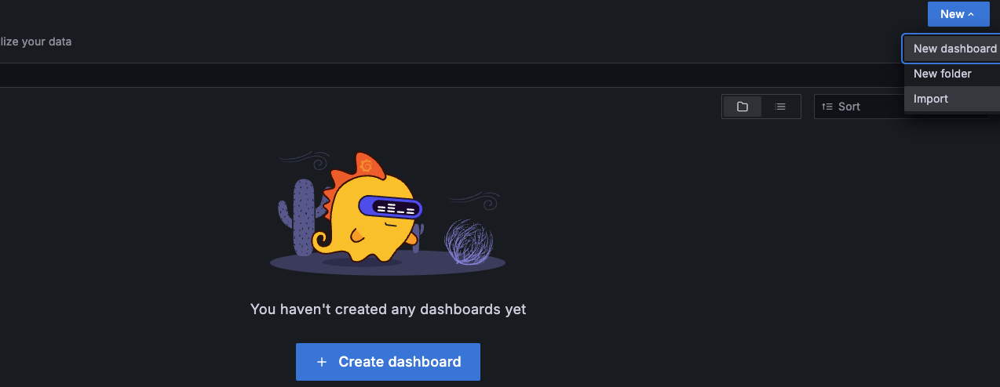
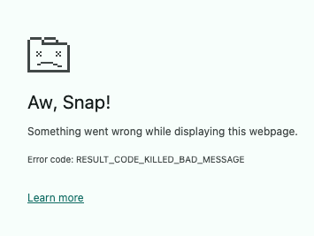
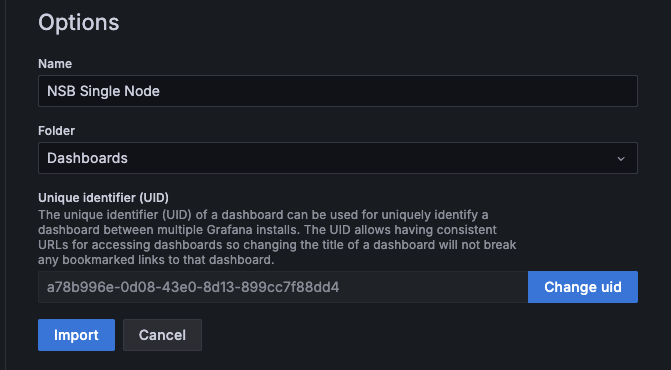

### Use the api key generated here and run the helper script to set in the vm

```
> ./set_grafana_apikey.sh
Enter token value:
```

## Nosqlbench examples:
   - Replace localIP with the local ip address of your vm

> sudo ./nb5 cql_starter default.schema host=<localIP> localdc=dc1
> sudo ./nb5 test.yaml default host=<localIP> localdc=dc1 rampup-cycles=1000 main-cycles=400000
